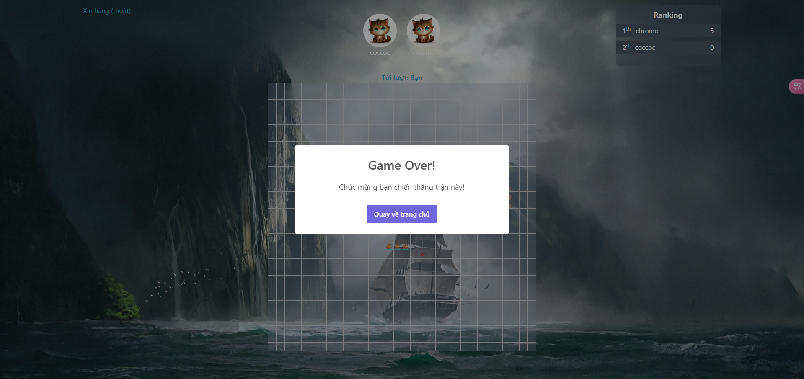

# Battleship
A real-time [battleship game](<https://en.wikipedia.org/wiki/Battleship_(game)>) (also known as Battleships or Sea Battle) for players, built with [React](https://reactjs.org/) and [Socket.IO](https://socket.io/).

The project is built on [create-react-app-example](https://create-react-app.dev/) of [Socket.io](https://socket.io/).


## Table of Content

- [Final Product](#final-product)
- [About the Game](#about-the-game)
- [Custom hook: useGame](#custom-hook-usegame)
- [Dependencies](#dependencies)
- [Getting Started](#getting-started)
- [File Structure](#file-structure)
              
## Final Product

1. When players first enter the game, they need to create a room and wait for others to join the game! 


2. The user creates a playroom and waits for others to join (For testing purpose, they can also open a new tab to create another player)


3. After all the players in the room are ready, the game starts, in the game everyone will take turns attacking the bricks, if that tile has a ship, the enemy will notify all players by burning that brick!


4. When you lose, you will be redirected to the home screen and notified, so will winning.



## About the Game

- When entering the game, each person sees a 32x32 matrix. 
- Each ship can be placed horizontally, vertically, or diagonally on the board and cannot be partially placed off the board, and the player can only see his ship. 
- Then, each player takes turns selecting a tile on the opponent's grid, shooting at it. 
- If the cell contains the ship, it will catch fire. 
- If the cell does not contain a ship, it is marked with an X.

- The game ends when all users escape, or only 1 player is left who has not been completely destroyed


## Dependencies

- [Node.js](https://nodejs.org/)
- [React](https://reactjs.org/)
- [Socket.io](https://socket.io/)
- [Redis](https://redis.io/)
- [MongoDB](https://www.mongodb.com/)

## Getting Started
1. Clone this project to your computer
2. `cd` to folders 'backend' and 'frontend' where this project is cloned
3. Install all dependencies with `npm install` command for both folders
4. Run project with `npm start` command for both folders
5. Open the broswer and visit: http://localhost:3000

The page will reload if you make edits. You will also see any lint errors in the console.

## File Structure

```
📦battle_ship
 ┣ 📂docs   // Store image for readme.md
 ┣ 📂backend
 ┃  ┣ 📂config // Config connect to Redis and MongoDB
 ┃  ┣ 📂controllers // Contains the files that are responsible for handling the tasks.
 ┃  ┣ 📂model // Contains entities such as: player, pointAttacked, room
 ┃  ┣ 📂module // Contains the file that is responsible for handling event socket
 ┃  ┣ 📂route // Contains the file that is responsible for routing
 ┃  ┣ 📂util
 ┃  ┃  ┣ 📜checkLost.js // Check if a player has lost
 ┃  ┃  ┣ 📜endGame.js // Check if the game is over
 ┃  ┃  ┣ 📜generateRandomShip.js // Generate a random ship
 ┃  ┃  ┣ 📜handleTurn.js // Handling player turn
 ┃  ┃  ┣ 📜startGame.js // Start the game
 ┃  ┣ 📜index.js 
 ┃  ┗ 📜.env
 ┣ 📂frontend
 ┃  ┣ 📂src
 ┃  ┃  ┣ 📂api // Store files fetch API
 ┃  ┃  ┣ 📂assets // Store static files or image displayed in the web app
 ┃  ┃  ┣ 📂component // Store the components
 ┃  ┃  ┣ 📂layout // Store all layouts
 ┃  ┃  ┣ 📂page // Store all pages
 ┃  ┃  ┣ 📂route // handling routing
 ┃  ┃  ┣ 📜App.js // Store component App
 ┃  ┃  ┣ 📜axios.js // Config axios
 ┃  ┃  ┣ 📜index.css // Main css
 ┃  ┃  ┣ 📜index.js 
 ┃  ┗ 📜.env
 ┗ 📂mockup  // Store sketch photo
```

